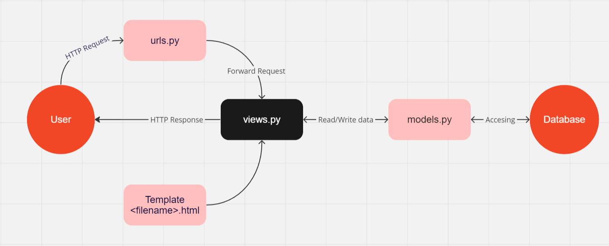

# **Goodang**

**Tugas 2 - Pemrograman Berbasis Platform**

**Syauqi Armanaya Syaki**<br/>
**2206829010**<br/>
**PBP D**<br/>

Dapat diakses melalui link [Goodang](https://goodang.adaptable.app/main/).

1. Jelaskan bagaimana cara kamu mengimplementasikan checklist di atas secara step-by-step (bukan hanya sekadar mengikuti tutorial).
2. Buatlah bagan yang berisi request client ke web aplikasi berbasis Django beserta responnya dan jelaskan pada bagan tersebut kaitan antara urls.py, views.py, models.py, dan berkas html.
3. Jelaskan mengapa kita menggunakan virtual environment? Apakah kita tetap dapat membuat aplikasi web berbasis Django tanpa menggunakan virtual environment?
4. Jelaskan apakah itu MVC, MVT, MVVM dan perbedaan dari ketiganya.

BONUS.... Kamu akan mendapatkan nilai bonus pada penilaian tugas ini apabila kamu berhasil mengimplementasikan dan mendemonstrasikan testing dasar selain testing yang diajarkan di tutorial. Dengan demikian, kamu tidak mendapatkan nilai bonus apabila kamu mengimplementasikan testing pengecekan berjalannya URL di aplikasi dan penggunaan template yang sesuai.

## **Membuat sebuah proyek Django baru**
1. Buat direktori lokal baru dengan nama yang diinginkan, contohnya `example_project` selanjutnya masuk ke dalam direktori tersebut dan buka *command prompt* (Windows) atau *terminal shell* (Unix).
2. Buat *virtual environment* untuk mengisolasi proyek kita dengan perintah `python -m venv env`.
3. Aktifkan *virtual environment* dengan cara `env\Scripts\activate.bat` untuk Windows dan `source env/bin/activate` untuk Unix (Mac/Linux).

**NOTE:** Pastikan *virtual environment* sudah aktif yang ditandai dengan `(env)` di baris input terminal

4. Buat file txt dengan nama `requirements.txt` di dalam direktori yang sama dan tambahkan beberapa *dependencies* ke dalamnya.
```txt
django
gunicorn
whitenoise
psycopg2-binary
requests
urllib3
```
5. Install *dependencies* yang sudah dimasukkan ke `requirements.txt` dengan menjalankan perintah `pip install -r requirements.txt`.
6. Buat proyek Django dengan nama yang diinginkan (saya menggunakan nama `goodang`) dengan perintah berikut. `django-admin startproject goodang .`

**NOTE:** Pastikan karakter `.` ditulis di akhir perintah

7. Buka `settings.py` lalu dibagian `ALLOWED_HOSTS` tambahkan `*` agar aplikasi dapat diakses semua host.
```python
...
ALLOWED_HOSTS = ["*"]
...
```
8. Jalankan server Django dengan perintah `python manage.py runserver` (Windows) atau `./manage.py runserver` (Unix). Pastikan ada file `manage.py` di direktori yang digunakan.
9. Buka http://localhost:8000 di web, jika terlihat animasi roket maka aplikasi Django berhasil dibuat.
10. Untuk menghentikan server, tekan `Ctrl+C` (Windows/Linux) atau `Control+C` (Mac) pada *shell*. Matikan *virtual environtment* dengan perintah `deactivate`

## **Membuat Aplikasi `main` dalam Proyek**
1. Jalankan perintah berikut di terminal atau *command prompt* yang dibuka dari direktori lokal. `python manage.py startapp main`
2. Buka `settings.py` untuk menambahkan ``main`` ke dalam daftar aplikasi.
```python
INSTALLED_APPS = [
    ...,
    'main',
    ...
]
```
## **Membuat `main.html`**
1. Buat direktori baru bernama `templates` di dalam direktori aplikasi main.
2. Buat file bernama `main.html` di dalam direktori `templates`.

## **Mengubah file `models.py` dalam `main`**
1. Buka file `models.py` dan isi dengan kode berikut.
```python
from django.db import models

class Item(models.Model):
    name = models.CharField(max_length=255)
    amount = models.IntegerField()
    description = models.TextField()
    price = models.IntegerField()
    category = models.CharField(max_length=255)
    date_added = models.DateField(auto_now_add=True)
```
**Penjelasan Kode:**
* `name` sebagai nama item yang tipenya `CharField`.
* `amount` sebagai jumlah item tipenya `IntegerField`.
* `description` sebagai deskripsi item yang tipenya `TextField`.
* `price` sebagai jumlah item tipenya `IntegerField`.
* `category` sebagai nama item yang tipenya `CharField`.
* `date_added` sebagai nama item yang tipenya `DateField`.
Bebas untuk menambahkan atribut lainnya jika diinginkan.
2. Jalankan perintah `python manage.py makemigrations` dan `python manage.py migrate` untuk melakukan migrasi pada Django.

> [!IMPORTANT]
> Setiap melakukan perubahan pada `models.py`, perlu melakukan migrasi untuk merefleksikan perubahan tersebut.

## **Menghubungkan `View` dengan `Template`**
1. Buka file `views.py` dan tambahkan baris berikut.
```python
from django.shortcuts import render

def show_main(request):
    context = {
        'name' : 'Kaos hitam polos',
        'amount': 20,
        'description':'Kaos polos pria berbahan Cotton Combed 30s round neck reguler fit',
        'price': 50000,
        'category': 'fashion pria'
    }

    return render(request, "main.html", context)
```
**Penjelasan Kode:**
* Import yang dilakukan dapat berguna untuk mengimpor fungsi *render* dari modul `django.shortcuts` yang digunakan untuk memproses tampilan HTML dengan data yang ada.
* Fungsi `show_main` berfungsi untuk mengatur permintaan HTTP dan mengembalikan tampilan yang tepat.
* `context` digunakan untuk mengirimkan data ke tampilan.
* `return render(request, "main.html", context)` digunakan untuk melakukan *rendering* tampilan `main.html` dengan menggunakan fungsi `render`yang memiliki argumen `request` sebagai objek permintaan HTTP dari *user*, `main.html` sebagai berkas template yang akan digunakan, dan `context` sebagai dictionary yang berisi data yang akan digunakan.

## **Memodifikasi template**
1. Buka file `main.html` yang sudah dibuat sebelumnya, dan isi dengan data yang akan kamu gunakan, contohnya:
```html
<h1>Goodang Page</h1>

<h5>Name: Syauqi Armanaya Syaki</h5>
<h5>Class: PBP D</h5>
<h5>ITEM: </h5>
<h5>Name: </h5>
<p>{{ name }}</p> <!-- Ubahlah sesuai dengan nama produk -->
<h5>Amount: </h5>
<p>{{ amount }}</p> <!-- Ubahlah sesuai dengan jumlah produk -->
<h5>Description: </h5>
<p>{{ description }}</p> <!-- Ubahlah sesuai dengan deskripsi produk -->
<h5>Price: </h5>
<p>{{ price }}</p> <!-- Ubahlah sesuai dengan harga produk -->
<h5>Category: </h5>
<p>{{ category }}</p> <!-- Ubahlah sesuai dengan harga produk -->
```
**Penjelasan Kode:**
* sintaks `{{}}` digunakan untuk menampilkan data yang telah didefinisikan di `context`.
* `main.html` diatas hanyalah contoh dan bisa dikembangkan.

## **Konfigurasi Routing URL**
1. Buat berkas `urls.py` di dalam direktori `main`, lalu isi dengan kode berikut.
```python
from django.urls import path
from main.views import show_main

app_name = 'main'

urlpatterns = [
    path('', show_main, name='show_main'),
]
```
2. Buka file `urls.py` di dalam direktori proyek (disini direktori saya bernama `goodang`), bukan yang di dalam direktori `main`. Lalu tambahkan impor berikut.
```python
...
from django.urls import path, include
...
```
3. Selanjutnya tambahkan rute url seperti berikut.
```python
urlpatterns = [
    ...
    path('main/', include('main.urls')),
    ...
]
```

## **Unit Testing**
1. Buka file `test.py` pada direktori `main`. Lalu isi dengan kode berikut.
```python
from django.test import TestCase, Client

class mainTest(TestCase):
    def test_main_url_is_exist(self):
        response = Client().get('/main/')
        self.assertEqual(response.status_code, 200)

    def test_main_using_main_template(self):
        response = Client().get('/main/')
        self.assertTemplateUsed(response, 'main.html')
    
    def test_item_details(self):
        response = Client().get('/main/')
        self.assertContains(response, 'Kaos hitam polos')
        self.assertContains(response, 20) 
        self.assertContains(response, 'Kaos polos pria berbahan Cotton Combed 30s round neck reguler fit') 
        self.assertContains(response, 50000) 
        self.assertContains(response, 'fashion pria')
```
2. Jalankan dengan perintah `python manage.py test`. Jika berhasil maka akan keluar seperti berikut.
```txt
Found 3 test(s).
Creating test database for alias 'default'...
System check identified no issues (0 silenced).
...
----------------------------------------------------------------------
Ran 3 tests in 0.025s

OK
Destroying test database for alias 'default'...
```

## **Membuat dan mengunggah proyek ke Github**
1. Di dalam direktori yang sudah dibuat, buka *command prompt* (Windows) atau *terminal shell* (Unix). Lalu inisiasi repositori baru dengan perintah `git init`.
2. Lakukan konfigurasi *username* dengan perintah `git config user.name "<NAME>"` dan *email* dengan perintah `git config user.email "<EMAIL>"` yang akan dihubungkan dengan proyekmu ke repositori Git. (*username* dan *email* disesuaikan dengan Github mu). Lalu pastikan informasi itu sudah berubah dengan menjalankan perintah `git config --list --local`.
3. Buka akun [Github](https://github.com/) yang akan digunakan, dan buat repositori baru dengan nama yang diinginkan (Contoh yang saya gunakan adalah `goodang_project`). Atur visibilitas menjadi *Public* dan biarkan yang lainnya sesuai *default* nya.
4. Pilih direktori lokal yang sudah diinisiasi Git, di terminal atau *command prompt* jalankan perintah `git branch -M main` untuk membuat branch utama dengan nama "main".
5. Jalankan perintah `git remote add origin <URL_REPO>` untuk menghubungkan direktori lokal dengan repositori di Github. (Gannti URL_REPO dengan URL HTTPS di direktori Github yang sudah dibuat).
6. Buat berkas `.gitignore` di direktori lokal dan diisi dengan teks berikut. (Berkas ini berfungsi untuk mengabaikan beberapa berkas oleh Git)
```.gitignore
# Django
*.log
*.pot
*.pyc
__pycache__
db.sqlite3
media

# Backup files
*.bak 

# If you are using PyCharm
# User-specific stuff
.idea/**/workspace.xml
.idea/**/tasks.xml
.idea/**/usage.statistics.xml
.idea/**/dictionaries
.idea/**/shelf

# AWS User-specific
.idea/**/aws.xml

# Generated files
.idea/**/contentModel.xml

# Sensitive or high-churn files
.idea/**/dataSources/
.idea/**/dataSources.ids
.idea/**/dataSources.local.xml
.idea/**/sqlDataSources.xml
.idea/**/dynamic.xml
.idea/**/uiDesigner.xml
.idea/**/dbnavigator.xml

# Gradle
.idea/**/gradle.xml
.idea/**/libraries

# File-based project format
*.iws

# IntelliJ
out/

# JIRA plugin
atlassian-ide-plugin.xml

# Python
*.py[cod] 
*$py.class 

# Distribution / packaging 
.Python build/ 
develop-eggs/ 
dist/ 
downloads/ 
eggs/ 
.eggs/ 
lib/ 
lib64/ 
parts/ 
sdist/ 
var/ 
wheels/ 
*.egg-info/ 
.installed.cfg 
*.egg 
*.manifest 
*.spec 

# Installer logs 
pip-log.txt 
pip-delete-this-directory.txt 

# Unit test / coverage reports 
htmlcov/ 
.tox/ 
.coverage 
.coverage.* 
.cache 
.pytest_cache/ 
nosetests.xml 
coverage.xml 
*.cover 
.hypothesis/ 

# Jupyter Notebook 
.ipynb_checkpoints 

# pyenv 
.python-version 

# celery 
celerybeat-schedule.* 

# SageMath parsed files 
*.sage.py 

# Environments 
.env 
.venv 
env/ 
venv/ 
ENV/ 
env.bak/ 
venv.bak/ 

# mkdocs documentation 
/site 

# mypy 
.mypy_cache/ 

# Sublime Text
*.tmlanguage.cache 
*.tmPreferences.cache 
*.stTheme.cache 
*.sublime-workspace 
*.sublime-project 

# sftp configuration file 
sftp-config.json 

# Package control specific files Package 
Control.last-run 
Control.ca-list 
Control.ca-bundle 
Control.system-ca-bundle 
GitHub.sublime-settings 

# Visual Studio Code
.vscode/* 
!.vscode/settings.json 
!.vscode/tasks.json 
!.vscode/launch.json 
!.vscode/extensions.json 
.history
```
7. Untuk melakukan penyimpanan pembaruan dapat melakukan `add`, `commit`, dan `push` dari terminal atau *command prompt* yang dibuka dari direktori lokal.

## **Membuat akun dan *Deploy* di Adaptable.io**
1. Buat akun [Adaptable.io](https://adaptable.io/) menggunakan akun Github yang digunakan untuk membuat proyek.
2. Tekan tombol `New App` dan pilih `Connect an Existing Repository`.
3. Hubungkan Adaptable.io dengan Github dengan memilih `All Repository` pada saat instalasi dan pilih repositori proyek (disini saya menggunakan proyek `goodang_project`) sebagai basisnya. Pilih *branch* yang ingin dijadikan *deployment branch*
4. Pilihlah `Python App Template` sebagai *template* dan `PostgreSQL` sebagai basis data.
5. Sesuaikan versi Python dengan punyamu dan pada bagian `Start Command` masukkan perintah `python manage.py migrate && gunicorn <NAMA_PROYEK>.wsgi`.
6. Masukkan nama aplikasi yang akan jadi nama *domain* situs webmu.
7. Centang bagian `HTTP Listener on PORT` dan klik `Deploy App` untuk memulai *Deployment*

## **Bagan *request* dan *response client* dengan Django**


* *User* mengakses website dan melakukan *HTTP request*.
* *Request* yang masuk akan diterima `urls.py` dan akan melakukan proses pencarian terhadap *pattern* url yang sesuai.
* Setelah menemukan yang sesuai, Django akan memanggil fungsi yang sesuai pada `views.py`, disini akan dilakukan *logic handling* dimana database dapat diakses dan diproses yang diambil dari `models.py`.
* `models.py` berfungsi sebagai file yang membuat dan mengatur data yang akan disimpan di database.
* *Database* adalah tempat dimana data aplikasi disimpan, dimana data disini dapat diubah sengan perintah dari `models.py`.
* *Template* disini berfungsi untuk mengatur tampilan halaman web yang akan dikembalikan ke *user*. Setelahnya maka akan dikembalikan ke user dalam bentuk *HTTP response (HTML)*.

## **Mengapa menggunakan *virtual environment*? Bagaimana jika tidak menggunakannya?**
Dengan menggunakan *virtual environment* maka sistem dapat bekerja di ruang yang terisolasi agar proyek yang kita kerjakan tidak berkonflik dengan proyek lain, karena setiap proyek memiliki kebutuhan atau dependensi yang berbeda. Dengan mengaktifkan *virtual environment* maka akan terdapat pembatas atau sekat yang dapat mencegah konflik tersebut.

Meskipun kita bisa membuat aplikasi web Django tanpa mengaktifkan virtual environment, namun sangat tidak disarankan karena kemungkinan besar akan menghadapi konflik antar dependensi dan menjadi sulit untuk mengelola proyek yang sedang dikerjakan. Oleh karenanya disarankan untuk mengaktifkan virtual environment untuk menghindari hal-hal tersebut.

## **MVC, MVT, dan MVVM**
MVC (Model-View-Controller), MVT (Model-View-Template), dan MVVM (Model-View-ViewModel) merupakan kerangka kerja arsitektur yang digunakan aplikasi dalam proses pengembangannya dengan memisahkan komponen-komponen dan dapat membuat pengelolaa menjadi lebih terstruktur.

## **MVC (Model-View-Controller)**
MVC merupakan kerangka yang membagi aplikasi menjadi 3 bagian, yaitu:
| **Model** | **View** | **Controller** |
| --- | --- | --- |
| Mengatur dan mengelola data aplikasi. | Mengurus logika tampilan informasi yang diambil dari Model kepada pengguna. | Menghubungkan Model dan View, mengatur alur kontrol aplikasi, dan mengolah input dari pengguna. |

## **MVT (Model-View-Template)**
MVT merupakan kerangka yang membagi 3 bagian dan mirip dengan MVC hanya saja controller diganti dengan template. MVT biasa digunakan pada pengembangan web dengan Django.
| **Model** | **View** | **Template** |
| --- | --- | --- |
| Mengatur dan mengelola data aplikasi. | Mengurus logika tampilan informasi yang diambil dari Model kepada pengguna. | Bertanggung jawab untuk merender tampilan dan mengatur bagaimana data dari Model ditampilkan di dalamnya. |

## **MVVM (Model-View-ViewModel)**
MVVM merupakan kerangka yang juga membagi 3 bagian dimana biasa digunakan untukpengembangan aplikasi desktop dan mobile.
| **Model** | **View** | **ViewModel** |
| --- | --- | --- |
| Mengatur dan mengelola data aplikasi. | Menampilkan informasi kepada pengguna berupa tampilan. | Bertindak sebagai perantara antara Model dan View. Ini mengelola logika tampilan dan transformasi data sebelum ditampilkan di View. |

## **Perbedaan Utama MVC, MVT, dan MVVM**
Perbedaan yang utama dari ketiganya dapat dilihat dari bagaimana pengelolaan komunikasi antara Model dan View dilakukan.

* Dalam MVC, Controller memiliki peran yang sangat penting yakni untuk mengatur informasi dari Model dan View.
* Dalam MVT, Template bekerja untuk mengatur tampilan yang akan ada pada web.
* Dalam MVVM, ViewModel bertindak sebagai penghubung dan berusaha untuk mengecilkan ketergantungan antara Model dan View. MVMM juga menerapkan konsep pengikatan data agar ketika ada pembaruan, maka akan otomatis diperbarui tampilannya.